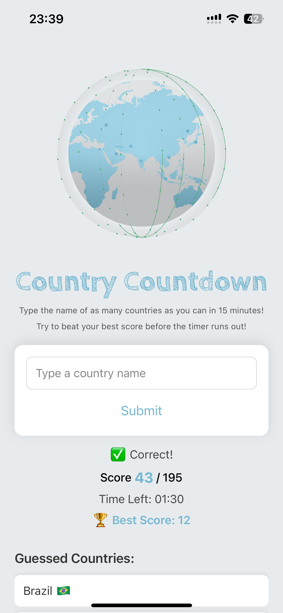
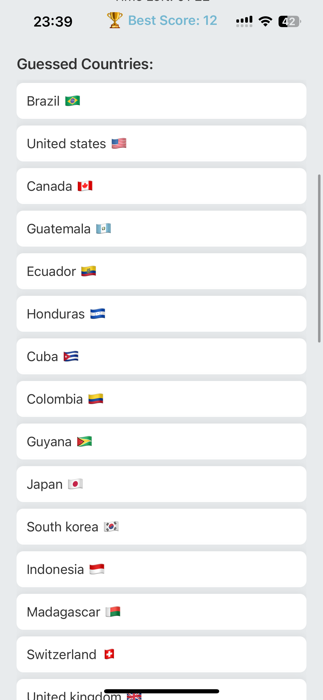

# 🌍 Country Countdown 🌍
Country Countdown is a React Native quiz game where players test their geography knowledge by naming as many countries as possible within 15 minutes. The game uses real-time data, stores the best score locally, and features a playful animated globe and custom fonts. 

This app is the first in a collection of geography games I hope to build and eventually combine into one interactive learning experience.

  
  

## Features
- 15-minute countdown timer
- Real-time country data from the REST Countries API ( https://restcountries.com/ )
- Best score is saved across sessions using AsyncStorage
- Feedback for correct, incorrect, and duplicate guesses
- Displays guessed countries with flags
- Restart and ClearBestScore buttons
- Custom hand-drawn font via expo-font
- Animated globe using a Lottie animation

## Installation

- Clone the repository

git clone https://github.com/helenaazv/country-countdown.git

cd country-countdown

- Install dependencies

npm install

- Run the app

npx expo start

## Key Dependencies

- react-native
- expo
- @react-native-async-storage/async-storage
- lottie-react-native
- expo-font

## How It Works
- Country Data: Fetched from the REST Countries API on app load.
- Input Matching: Case-insensitive matching of typed country names against all 195 countries.
- Flag Emoji: Country codes are converted to emoji flags using Unicode logic.

## Game Flow:
- Timer starts on the first guess.
- Score increments for correct, unique countries.
- Ends after 15 minutes 
- When the game is over the player can restart the game.
- Best score is stored using AsyncStorage and displayed each session (Best score can be cleared at the end of each match if user wishes to do so)

## Author
Made with love inspired by the memory of guessing countries with my mom on the way to school.
